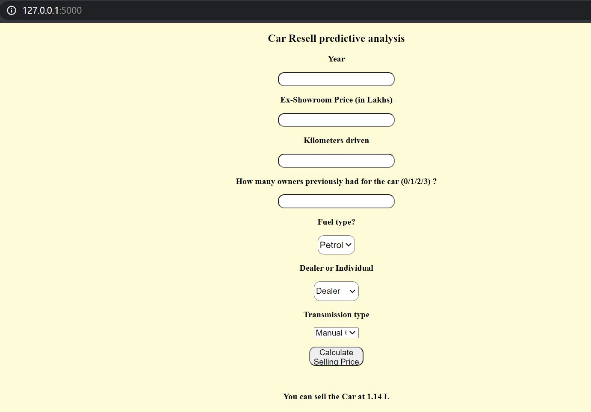

# Resale car price estimation (Deployed on Heroku using Flask)

[CarDekho.com](www.cardekho.com) is India's leading car search venture that helps users buy cars that are right for them. The company has tie-ups with many auto manufacturers, more than 4000 car dealers and numerous financial institutions to facilitate the purchase of vehicles.  
This dataset contains information about used cars listed on the website. The dataset is available on [kaggle](https://www.kaggle.com/nehalbirla/vehicle-dataset-from-cardekho)  
The predictive model on used cars price estimator is deployed on Heroku-app using Flask can be found [here](https://resale-car-price-estimator.herokuapp.com/) 

To use the project:
- first check with requirements from requirements.txt
- run app.py locally
- to deploy - heroku-app can be used

### Docker build
- clone the repo
- docker build . -t[give a name]
